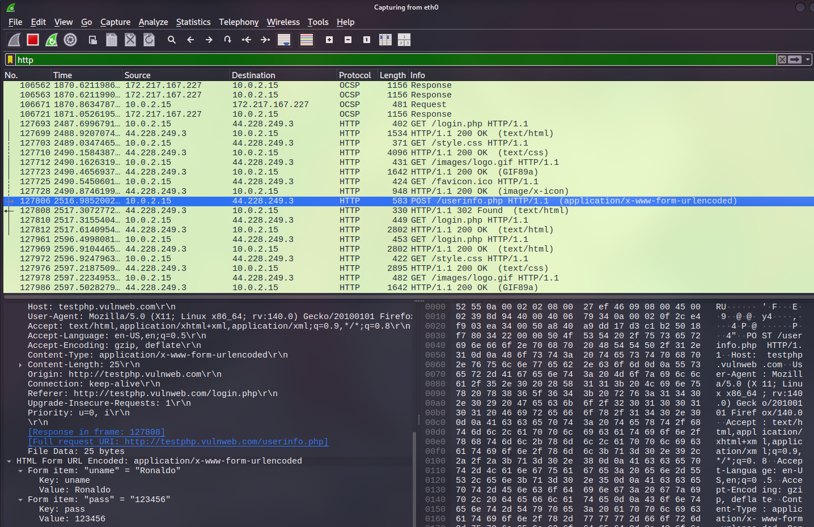
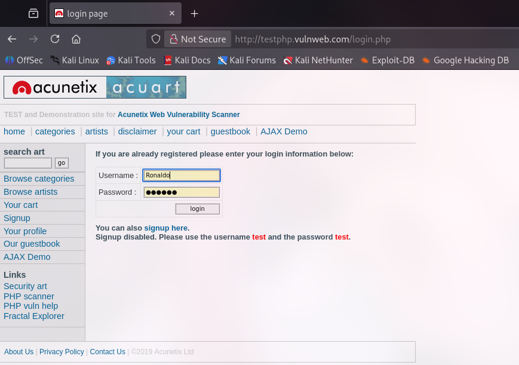

# Lab 1: The "Cleartext" Capture (HTTP)

**Category:** Network Traffic Analysis / Cybersecurity Fundamentals

## Tools Used
* **Wireshark:** Network protocol analyzer for capturing and inspecting packets.
* **Web Browser:** Firefox
* **Target Website:** `http://testphp.vulnweb.com` (A legal, intentionally vulnerable test site).

## Lab Setup
* **Host OS:** Arch linux
* **Virtual Machine:** VirtualBox
* **Guest OS:** Kail linux
* **Environment:** Host machine connected to a local Wi-Fi network.
* **Configuration:** Wireshark installed with Npcap/WinPcap to allow promiscuous mode (capturing traffic destined for other addresses or the host itself).
* **Objective:** To demonstrate the insecurity of the HTTP protocol by intercepting and reading user credentials in transit.

## Steps Performed
1.  **Launched Wireshark:** Selected the active network interface (Wi-Fi) to begin packet capturing in real-time.
2.  **Generated Traffic:**
    * Navigated to the login page of the test site (`http://testphp.vulnweb.com/login.php`).
    * Entered dummy credentials:
        * **Username:** `Ronaldo`
        * **Password:** `123456`
    * Clicked the "Login" button to transmit the data.
3.  **Captured & Filtered:**
    * Stopped the Wireshark capture immediately after the login attempt to minimize noise.
    * Applied the display filter `http"` to isolate the packet containing the form submission.
4.  **Analyzed the Payload:**
    * Identified the HTTP POST request packet.
    * Right-clicked the packet and selected **Follow > TCP Stream** to reconstruct the entire conversation.
    * Located the raw data payload at the bottom of the stream.

## What I Learned
* **HTTP lacks encryption:** I observed that the Hypertext Transfer Protocol (HTTP) sends all data, including sensitive login credentials, in **plain text**.
* **Visibility of Data:** Anyone positioned on the same local network (LAN) can easily capture and read this traffic using standard tools like Wireshark.
* **Packet Analysis:** I learned how to use Wireshark filters to isolate specific actions (like a POST request) and how to use "Follow TCP Stream" to view the application-layer data in a human-readable format.
* **Security Implication:** This lab reinforced why protocols like HTTPS (TLS/SSL) are mandatory for any application handling user data; without encryption, there is zero confidentiality.

## Screenshots

