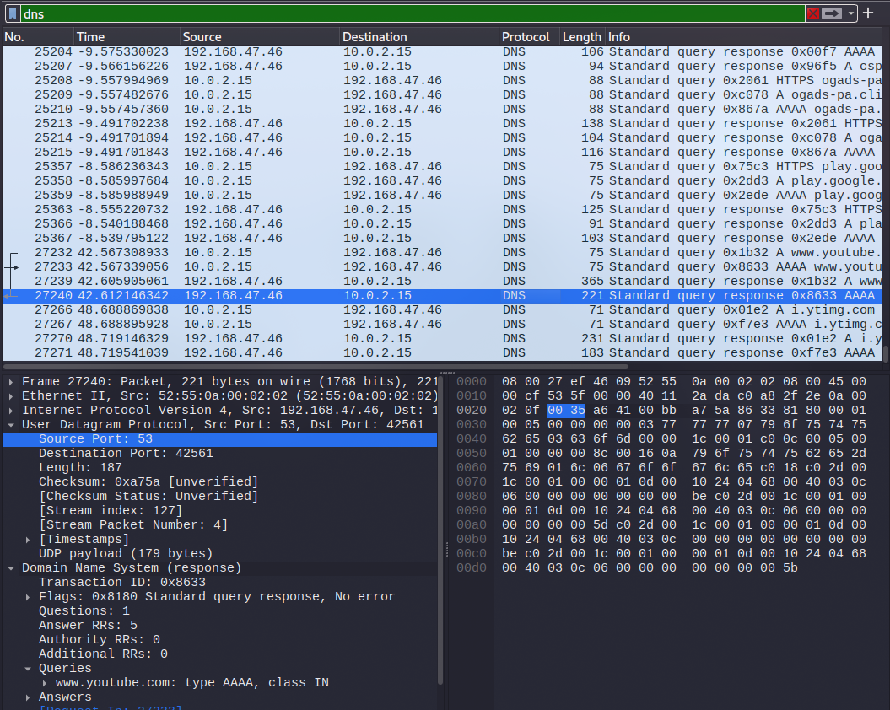

# Lab 2: The "Phone Home" Investigation (DNS Analysis)

**Category:** Network Traffic Analysis

## Tools Used
* **Wireshark:** Network protocol analyzer.
* **Host Machine/VM:** Used to generate background and active application traffic.
* **Target Services:** General web browsing (YouTube, Google services).

## Lab Setup
* **Environment:** Local Virtual Machine (IP: `10.0.2.15`) connected via NAT.
* **Configuration:** Wireshark set to capture traffic on the primary network interface.
* **Objective:** To identify and analyze the Domain Name System (DNS) traffic to understand how applications resolve domain names and "phone home" to remote servers.

## Steps Performed
1.  **Traffic Capture:**
    * Started Wireshark and began capturing packets on the active interface.
    * Allowed background processes to run and actively browsed to video streaming sites (YouTube) to generate specific DNS queries.
2.  **Filtering:**
    * Applied the display filter `dns` to remove TCP/HTTP noise and focus strictly on name resolution traffic.
3.  **Analysis:**
    * Identified **Standard query** packets sent from my source IP (`10.0.2.15`) asking for domain resolutions.
    * Identified **Standard query response** packets returned by the gateway/DNS server (`192.168.47.46`).
    * Inspected specific queries in the "Info" column, observing traffic for:
        * `www.youtube.com` (Video content)
        * `play.google.com` (App store services)
        * `i.ytimg.com` (YouTube thumbnails/images)
        * `ogads-pa` (Ad/Tracking services)
4.  **Packet Inspection:**
    * Selected Packet #27240 (Response for `www.youtube.com`).
    * Verified the **User Datagram Protocol (UDP)** layer, confirming that standard DNS operates on **Port 53**.

## What I Learned
* **DNS Visibility:** I learned that even encrypted traffic (HTTPS) starts with a plaintext DNS query. By monitoring DNS, I can see exactly which websites or services a user is visiting (`youtube.com`), even if I cannot see the content of the video itself.
* **Background Activity:** I observed that modern operating systems and browsers constantly communicate with backend services (like Google Play or ad servers) without explicit user interaction.
* **Protocol distinctness:** Unlike the HTTP TCP traffic in Lab 1, DNS primarily uses UDP for speed, evidenced by the lack of a "handshake" (SYN/ACK) in the captured packets.
* **Reconnaissance Value:** I realized that DNS logs are a goldmine for identifying user behavior and potential malware "beaconing" to command-and-control servers.

## Screenshorts

