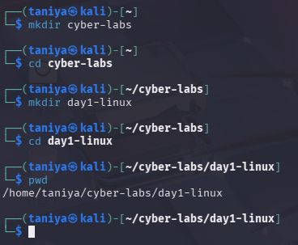

# Day 1 – Linux Basics Home Lab

## Objective
Practice essential Linux commands in a security-focused environment.

## Commands Practiced
ls, cd, pwd, mkdir, rm  
cat, less, head, tail  
chmod, chown  
ps, top, kill  

## What I Did
- Created a structured lab directory
- Practiced file viewing and editing
- Modified permissions and ownership
- Monitored and killed running processes
- Simulated basic log analysis

## What I Learned
- How Linux permissions protect files
- How attackers hide processes
- Why log analysis is important in security

## Screenshots

