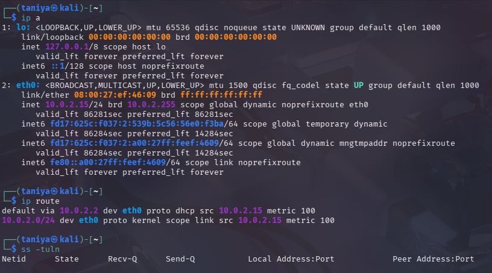
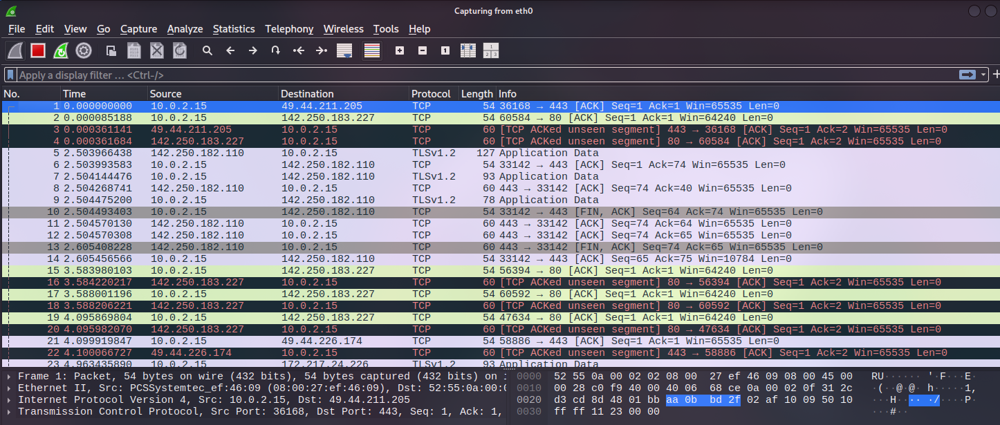
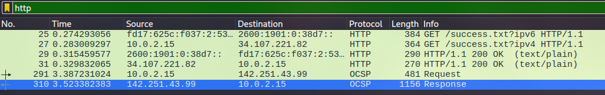
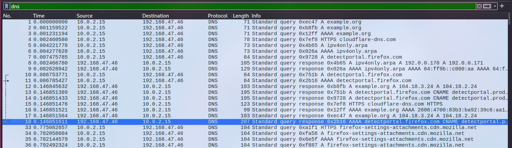
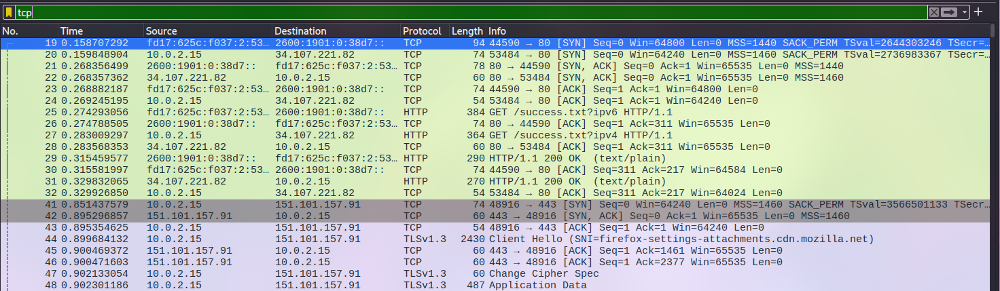
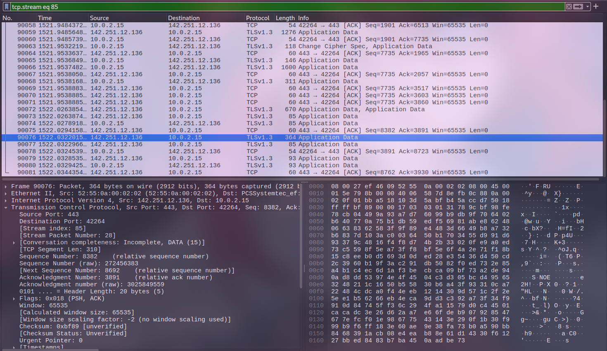

# Day 3 – Networking & Wireshark

## Objective
Understand basic networking concepts and analyze live network traffic using Wireshark.

## Tools Used
- Linux networking commands
- Wireshark

## What I Did
- Identified local IP and open ports
- Captured live network traffic
- Applied protocol-based filters
- Compared HTTP and HTTPS traffic
- Analyzed packets from attacker and defender perspectives

## What I Learned
- How network traffic flows
- Why encrypted traffic is important
- How attackers inspect unencrypted traffic
- How defenders analyze packet data

## Screenshots

