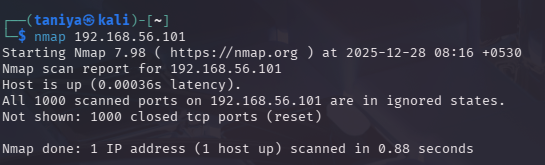
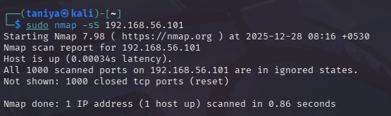
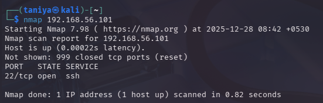
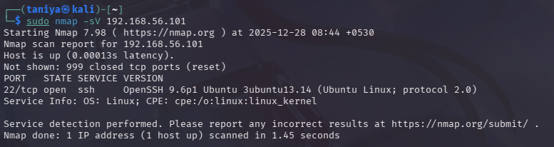
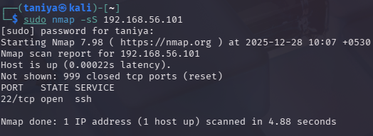

# Day 4 – Network Reconnaissance Using Nmap

## Objective
To understand how enabling or disabling network services changes a system’s visibility and attack surface. This lab involves scanning a Linux Mint machine from a Kali Linux attacker machine using **Nmap** to observe the differences between a secure and an intentionally vulnerable state.

---

## Lab Environment
- **Attacker Machine:** Kali Linux
- **Target Machine:** Linux Mint
- **Virtualization Platform:** Oracle VirtualBox
- **Network Type:** Host-Only / NAT
- **Tool Used:** Nmap

---

## Walkthrough

### Step 1: Initial Scan (Before Enabling Any Service)
**Context:** The Linux Mint system was scanned from Kali Linux before enabling SSH or modifying firewall rules.

**Command Used:**
```bash
nmap <mint-ip>
```

**Result:**
* Host was reachable.
* All 1000 scanned TCP ports were **closed**.
* No services were visible.

**Observation:**
The system appeared secure because no network services were exposed to the network.

**Screenshot:**



---

### Step 2: SYN Scan for Stealth Reconnaissance
**Context:** A stealth scan was performed to understand how attackers enumerate ports quietly.

**Command Used:**
```bash
sudo nmap -sS <mint-ip>
```

**Result:**
* All ports were closed.
* No open services detected.

**Learning:**
* `-sS` performs a **half-open scan**.
* This method is faster and harder to detect than a full connect scan.
* Requires `root` privileges.

**Screenshot:**



---

### Step 3: Enabling SSH and Disabling Firewall (Intentional Exposure)
**Context:** To simulate a vulnerable configuration, SSH was enabled and the firewall was turned off on the Mint system.

**Commands Used (on Mint):**
```bash
sudo apt install openssh-server -y
sudo systemctl start ssh
sudo ufw disable
```

---

### Step 4: Scan After Service Exposure
**Context:** The same scans were repeated after enabling SSH.

**Commands Used:**
```bash
nmap <mint-ip>
nmap -sV <mint-ip>
sudo nmap -sS <mint-ip>
```

**Result:**
* **Port 22/tcp** was open.
* **SSH service** was detected.
* Service version information was revealed using `-sV`.

**Screenshots:**







---

## What I Learned

### Nmap Scan Types
1.  **Default Scan (`nmap`)**
    * Detects open and closed ports.
    * Performs TCP connect scanning (completes the 3-way handshake).
2.  **SYN Scan (`-sS`)**
    * Stealthy and fast.
    * Sends SYN packets without completing the handshake.
    * Commonly used in real-world attacks.
3.  **Service Version Detection (`-sV`)**
    * Identifies running services and specific versions.
    * Helps attackers select targeted exploits based on version numbers.

### Core Concepts
* **Open Ports:** Exist only when services are actively running.
* **Firewalls:** Directly control service visibility; turning them off exposes the system.
* **Attack Surface:** Even a single exposed service increases the attack surface.
* **Reconnaissance:** The foundation of all cyber attacks.

---

## Security Insight
This lab demonstrated how small configuration changes can significantly impact system security. Disabling unnecessary services and enforcing firewall rules are critical for hardening systems.

## Tools Used
* **Nmap**
* **OpenSSH Server**
* **UFW Firewall**
* **Kali Linux**
* **Linux Mint**
